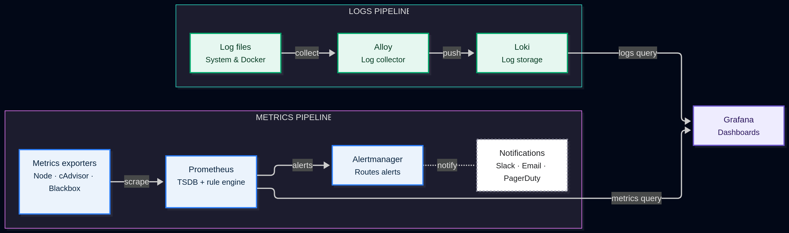

# Monitoring Stack with Docker

    

A complete, production-style observability stack built with **Prometheus, Grafana, Loki, Alloy, Alertmanager, cAdvisor, Blackbox Exporter, Node Exporter, and Process Exporter** — fully containerized with Docker Compose.

This project covers both **metrics** (via Prometheus) and **logs** (via Loki), unified in Grafana dashboards, with automated alerting through Alertmanager.

---

## Architecture



- **Metrics pipeline:** exporters (Node, cAdvisor, Blackbox) are scraped by Prometheus, which evaluates alert rules and forwards firing alerts to Alertmanager, which routes notifications (Slack / Email / PagerDuty).
- **Logs pipeline:** system and Docker logs are collected by Alloy and pushed to Loki.
- Both pipelines are queried and visualized together in **Grafana**.

---

## Services

| Service | Role | Port |
|---|---|---|
| **Prometheus** | Metrics collection & alert rule engine | `9090` |
| **Grafana** | Dashboards & visualization | `3000` |
| **Alertmanager** | Alert routing & notifications | `9093` |
| **Loki** | Log storage | `3100` |
| **Alloy** | Log collector (system & Docker logs) | — |
| **Node Exporter** | Host system metrics | `9100` |
| **cAdvisor** | Container resource metrics | `8080` |
| **Blackbox Exporter** | Endpoint / probe monitoring | `9115` |
| **Process Exporter** | Per-process metrics | `9256` |

---

## Usage

Clone the repository and start the stack:

```bash
git clone https://github.com/meriem-brk/monitoring-project.git
cd monitoring-project
docker compose up -d
```

Access the services:

- Grafana: [http://localhost:3000](http://localhost:3000)
- Prometheus: [http://localhost:9090](http://localhost:9090)
- Alertmanager: [http://localhost:9093](http://localhost:9093)

---

## Dashboards

### Node Exporter — System Overview

*Host-level system metrics: CPU, memory, disk, and network usage.*


*Detailed CPU and memory trends over time.*


*Network traffic and disk space usage.*

### Blackbox Exporter — Probe Duration

*Endpoint probe monitoring — response time and uptime status.*

### cAdvisor — Container Metrics

*Per-container resource usage: CPU, memory, and network.*

### Logs (Loki)

*Centralized log search across system and Docker containers.*

### Process Exporter

*Per-process resource consumption on the host.*

---

## Project Structure

```
monitoring-project/
├── docker-compose.yml
├── prometheus.yml
├── rules.yml
├── alertmanager.yml
├── alloy-config.alloy
├── promtail-config.yml
├── process-exporter-config.yml
└── assets/
    └── screenshots/
```

---

## Notes

- Alertmanager only receives fired alerts from Prometheus — it never scrapes metrics itself.
- Alloy (collector) and Loki (storage) are separate components in the logging path.

---

## Author

**Meriem** — Freelance DevOps / Infrastructure Monitoring  
GitHub: [@meriem-brk](https://github.com/meriem-brk)
