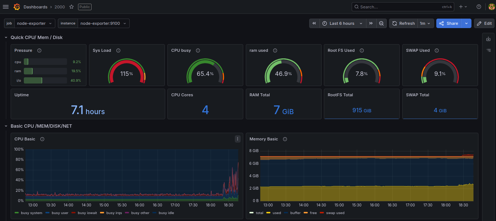
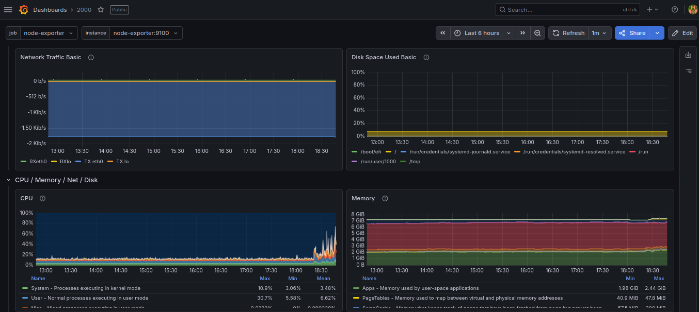
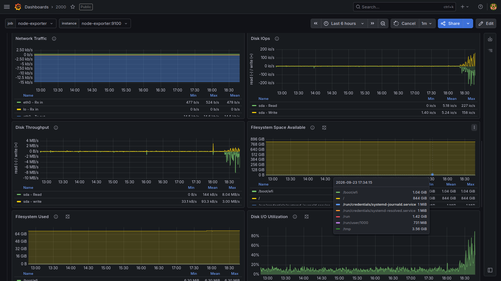
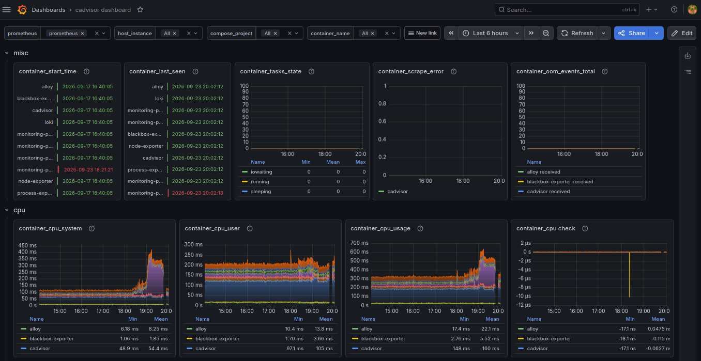
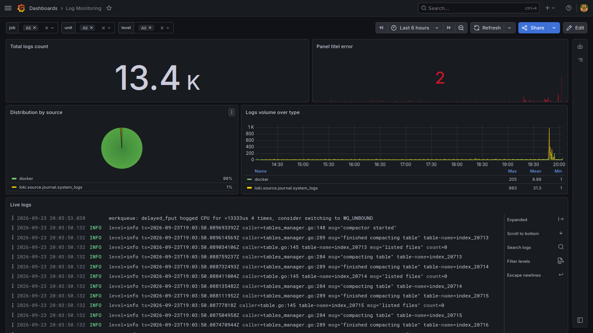
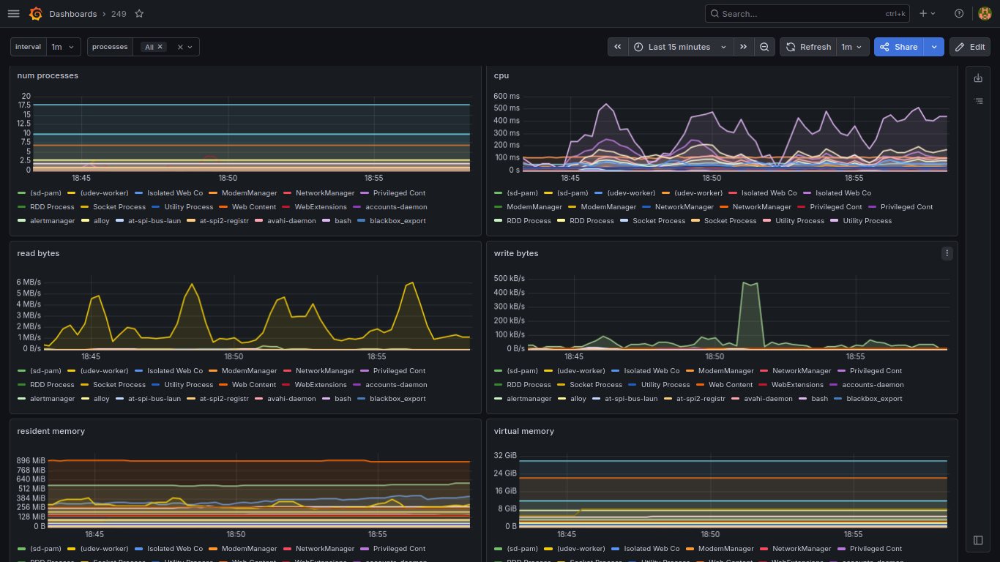
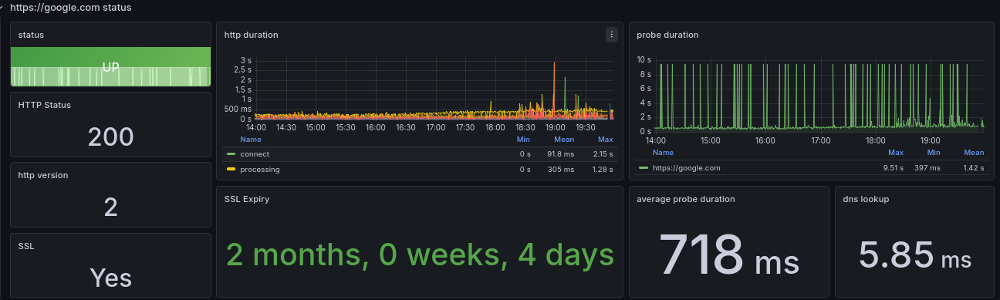
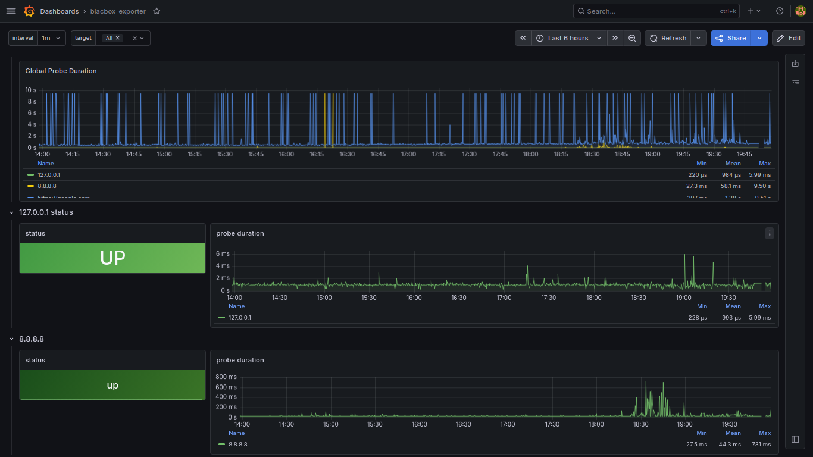

> # Monitoring Stack with docker
> 
> A full monitoring stack using Prometheus,Grafana, and Node exporter.
> 
> ## Services
> - **Prometheus** - Metrics collection (port 9090)
> - **Grafana** - Visualization dashboards (port 3000)
> - **Node Exporter** - System metrics (port 9100)
> 
> ## Usage
> '''bash
> docker compose up -d
Access Grafana at:http://localhost:3000
>
> ## 📊 Dashboards & Observability Overview

| 🖥️ Node Exporter (System Overview) | 🖥️ Node Exporter (CPU & RAM) |
| :---: | :---: |
|  |  |

| 🖥️ Node Exporter (Metrics Detail) | 🐳 cAdvisor (Containers Monitoring) |
| :---: | :---: |
|  |  |

| 📝 Loki Logs & Exploration | ⚙️ Process Exporter |
| :---: | :---: |
|  |  |

| 🌐 Blackbox Exporter (Probe Metrics) | 🌐 Blackbox Exporter (Status) |
| :---: | :---: |
|  |  |

